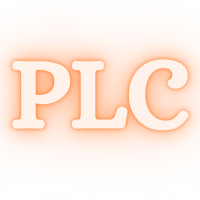

<div id="top"></div>

<!-- PROJECT SHIELDS -->

<!-- PROJECT LOGO -->
<br />
<div align="center">
  <a href="https://github.com/christopher-chandler/Python-Pour-les-Curieux">
    
  </a>

![Version][Version-shield]  [![MIT License][license-shield]][license-url] ![update][update-shield]

[![Stargazers][stars-shield]][stars-url]

![Windows][windows-shield] ![Mac][Mac-shield]


<h3 align="center">Python pour les curieux</h3>

  <p align="center">
    Un cours basique pour apprendre et comprendre les bases du langage Python. Ce n'est pas 
pour les nuls, mais plutôt pour eux qui sont curieux ! 
    <br />
    <br />
    <a href="https://github.com/christopher-chandler/Python-pour-les-curieux/issues">Rapport de bogue</a>
    ·
    <a href="https://github.com/christopher-chandler/Python-pour-les-curieux/issues">Demande de fonctionnalité</a>
  </p>
</div>

<!-- TABLE OF CONTENTS -->
<details>
<summary>Table des matières</summary>
  
<ol>
    <li>
      <a href="#Renseignements-sur-ce-projet">Renseignements sur ce projet</a>
      <ul>
        <li><a href="# Qui-êtes-vous-?"> Qui êtes-vous ?</a></li>
      </ul>
      <ul>
        <li><a href="#Pourquoi-créez-vous-ce-projet ?">Pourquoi créez-vous ce projet ?</a></li>
      </ul>
      <ul>
        <li><a href="# Comment-puis-je-vous-aider-?"> Comment puis-je vous aider ?</a></li>
      </ul>
      <ul>
        <li><a href="#Frameworks">Frameworks</a></li>
      </ul>
    </li>
    <li>
      <a href="#Pour-commencer">Pour commencer</a>
      <ul>
        <li><a href="#Prerequisites">Prerequisites</a></li>
        <li><a href="#Installation">Installation</a></li>
      </ul>
    </li>
    <li><a href="#Usage">Usage</a></li>
    <li><a href="#Futures fonctionnalités">Futures fonctionnalités</a></li>
    <li><a href="#Contribution">Contribution</a></li>
    <li><a href="#License">License</a></li>
    <li><a href="#Contact">Contact</a></li>
    <li><a href="#Acknowledgments">Acknowledgments</a></li>
    <li><a href="#Sources">Sources</a></li>
  
</ol>

</details>

<!-- ABOUT THE PROJECT -->
## Renseignements sur ce projet

<div align="center">
  <a href="https://github.com/christopher-chandler/Python-pour-les-curieux">
   </a>
</div>
<p align="right">(<a href="#top">Haut de page </a>)</p>


#### Qui êtes-vous ?

Bonjour, 

Je voudrais me présenter. Je m'appelle Christopher Michael Chandler, 
mais je préfère Chris. Je suis Américain habitant en Allemagne 
depuis 2011. J'ai étudié en 2021 le français et la linguistique informatique à 
l'université de Bochum parce que j'adore la programmation et la linguistique
générale. 

#### Pourquoi créez-vous ce projet ?

Je développe PLC (Python pour les curieux) pour aider ceux qui 
voudraient apprendre Python. Je vous offre des explications
et exercises faciles afin que vous puisiez obtenir gratuitement
des competences informatiques basiques par rapport à Python.

Comme je viens de commencer ce projet et je le fais tout seule, 
je le mettrai à jour peu à peu. Donc, contrôlez ce dépôt régulièrement 
pour découvrir les nouveautés.   

#### Comment puis-je vous aider ? 

Comme j'ai déjà dit, ce projet et ce cours sont complètement gratuits. 
Cependant, si vous voulez m'aider d'améliorer ce projet pour que je puisse 
aider les autres, lisez les sections <a href="#Contribution">Contribution</a>
et <a href="#Contact">Contact</a> pour savoir comment 
vous pouvez me contacter et contribuer à ce projet communautaire.


### Frameworks

Les frameworks avec lesquels j'ai créé ce cours. 
* [Jupyter Notebooks](https://jupyter.org/)
 

<p align="right">(<a href="#top">Haut de page </a>)</p>


<!-- GETTING STARTED -->
## Pour commencer

Clickez sur ce [lieu][download] pour télécharger ce projet localement. 

C'est également possible de suivre ce cours sans devoir télécharger ni python
ni ce projet parce que l'on peut lire les cahiers Jupyters sur Github et 
programmer dans le navigateur. 


### Prerequisites

Pour utiliser Python et programmer, il a plusieurs options disponibles. 
Je vous propose donc deux options premières : 
* [Google Colabs](https://colab.research.google.com/?hl=fr)
* [Installation locale](https://www.python.org/downloads/)

Au début, ce n'est pas nécessaire d'installer Python sur votre appareil. 
Si vous n'avez pas un propre ordinateur ou si vous ne voulez pas l'installer
pour certaines raisons, je vous recommande [Google Colabs](https://colab.research.google.com/?hl=fr)
car c'est gratuit et parfait pour programmer dans le navigateur de votre choix. 
Cependant, pour créer des programs plus complexes et grands, 
il convient d'avoir une [Installation locale](https://www.python.org/downloads/).
Si vous voulez savoir comment l'on installe Python localement, lisez `leçon 0`.

### Installation

Si vous voulez lire les cahiers sur votre ordinateur local, il faut installer
python et les bibliothèques dans le fichier `requirement.txt`. Vous effectuez 
l'installation un tapant la commande 

```
pip install -r requirements.txt
 ```
dans [invite de commandes](https://fr.wikipedia.org/wiki/Cmd).

<p align="right">(<a href="#top">Haut de page </a>)</p>


<!-- USAGE EXAMPLES -->
## Usage

Vous pouvez utiliser ce dépôt pour apprendre le Python. 

<p align="right">(<a href="#top">Haut de page </a>)</p>


<!-- ROADMAP -->
## Futures fonctionnalités

- [ ] Langage Python - qu'est-ce que c'est?

Voyez [les problèmes non résolus][les-problèmes-non-résolus]
pour voir une liste complète de caractéristiques proposées (et de problèmes connus).

<p align="right">(<a href="#top">Haut de page </a>)</p>


<!-- CONTRIBUTING -->
## Contribution

A grâce de contributions, la communauté du logiciel libre est une communauté 
magnifique où l'on peut apprendre, créer et inspirer les autres. Chaque 
contribution à ce projet sera **très appréciée**. 

Si vous avez une suggestion pour améliorer ce projet, faites un 
dépôt forké et créez une demande d'extraction. Vous pouvez aussi simplement créer 
un problème non résolu en utilisant le tag `enhancement`. 

N'oubliez pas de donner une étoile à ce projet ! Merci beaucoup pour votre 
support !


1. Créez un dépôt forké
2. Créez une branche (`git checkout -b feature/AmazingFeature`)
3. Commitez vos changements (`git commit -m 'Add some AmazingFeature'`)
4. Transmettez vos changements vers la branche (`git push origin feature/AmazingFeature`)
5. Créez une demande d'extraction

<p align="right">(<a href="#top">Haut de page </a>)</p>


<!-- LICENSE -->
## License

Ce projet est distribué sous la license MIT. Pour obtenir plus d'informations, 
consultez le fichier `LICENSE`, s'il vous plaît. 

<p align="right">(<a href="#top">Haut de page </a>)</p>


<!-- CONTACT -->
## Contact

* Christopher Chandler - christopher.chandler@outlook.de
* Lien du projet: [PLC][Lien-du-projet]

<p align="right">(<a href="#top">Haut de page </a>)</p>


<!-- ACKNOWLEDGMENTS -->
## Acknowledgments

* Mon amie qui m'a demandé si je pourrais l'aider pour apprendre le langage du python. 

<p align="right">(<a href="#top">Haut de page </a>)</p>


<!-- Sources -->

## Sources
Les sources que j'ai utilisées pour créer ce cours : 


### Livres 

### Sites web 

### Videos

<p align="right">(<a href="#top">Haut de page </a>)</p>

<!-- MARKDOWN LINKS & IMAGES -->

<!-- LINKS -->
[download]: https://github.com/christopher-chandler/Python-Pour-les-Debutants/archive/refs/heads/main.zip
[les-problèmes-non-résolus]: (https://github.com/christopher-chandler/Python-pour-les-curieux/issues) 
[Lien-du-projet]: (https://github.com/christopher-chandler/Python-pour-les-curieux)

<!-- SHIELDS -->
[contributors-shield]: https://img.shields.io/github/contributors/christopher-chandler/Python-pour-les-curieux?color=green&logoColor=%20
[contributors-url]: https://github.com/christopher-chandler/Python-pour-les-curieux/graphs/contributors

[stars-shield]: https://img.shields.io/github/stars/christopher-chandler/Python-pour-les-curieux?logoColor=yellow&style=social
[stars-url]: https://github.com/christopher-chandler/Python-pour-les-curieux/stargazers

[license-shield]: https://img.shields.io/github/license/christopher-chandler/Python-pour-les-curieux?color=yellow&logoColor=%20
[license-url]: https://github.com/christopher-chandler/Python-pour-les-curieux/blob/main/LICENSE

<!-- BASIC SHIELDS -->
[download-shield]: https://img.shields.io/github/downloads/christopher-chandler/Python-pour-les-curieux/total
[windows-shield]: https://img.shields.io/badge/Windows-Tested-purple 
[mac-shield]: https://img.shields.io/badge/Mac-Tested-purple
[version-shield]: https://img.shields.io/badge/Version-0.0.1-brightgreen
[update-shield]: https://img.shields.io/badge/Last_Updated-Mars_2022-blue